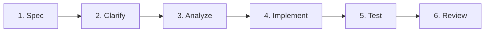

# Quy trình phát triển Spec-Kit 6 bước

Quy trình này định nghĩa các bước bắt buộc bạn (AI Agent) phải tuân thủ khi phát triển bất kỳ tính năng hoặc sửa lỗi nào trong dự án FIT AI. Mục tiêu là đảm bảo chất lượng mã nguồn, hạn chế lỗi logic và tối ưu hóa sự tương tác với người dùng.

---

## CÁC BƯỚC THỰC HIỆN CHI TIẾT

### 1. Spec (Đặc tả yêu cầu ban đầu)
* **Mục tiêu**: Nắm bắt trọn vẹn yêu cầu từ người dùng và xác định các khu vực bị ảnh hưởng trong dự án.
* **Hành động**: Tạo một bản kế hoạch hoặc đặc tả yêu cầu sơ bộ (Spec) lưu dưới dạng file markdown tạm thời trong artifacts.
* **Tài liệu hướng dẫn**: [references/1-spec.md](references/1-spec.md).

### 2. Clarify (Làm rõ các điểm mơ hồ)
* **Mục tiêu**: Loại bỏ tất cả các giả định không chắc chắn bằng cách tương tác với người dùng.
* **Hành động**: Đưa ra câu hỏi làm rõ dạng trắc nghiệm hoặc danh sách ngắn cho người dùng. Khuyến khích sử dụng công cụ `ask_question`.
* **Tài liệu hướng dẫn**: [references/2-clarify.md](references/2-clarify.md).

### 3. Analyze (Phân tích và Thiết kế giải pháp kỹ thuật)
* **Mục tiêu**: Nghiên cứu codebase hiện tại, phân tích luồng dữ liệu, schema DB và thiết kế kiến trúc giải pháp.
* **Hành động**: Trình bày giải pháp kỹ thuật, cấu trúc thư mục/file mới, thay đổi DB và API endpoint cho người dùng duyệt trước.
* **Tài liệu hướng dẫn**: [references/3-analyze.md](references/3-analyze.md).

### 4. Implement (Hiện thực hóa viết code)
* **Mục tiêu**: Hiện thực hóa giải pháp bằng code chất lượng cao, đúng chuẩn của dự án.
* **Hành động**: Viết code sạch, tối ưu, giữ nguyên comment/docstring không liên quan, không dùng placeholder.
* **Tài liệu hướng dẫn**: [references/4-implement.md](references/4-implement.md).

### 5. Test (Kiểm thử mã nguồn)
* **Mục tiêu**: Đảm bảo code mới hoạt động chính xác và không gây lỗi (regression) cho các tính năng cũ.
* **Hành động**: Chạy các unit test hiện có, viết thêm unit test cho code mới. Nếu có lỗi, tự phân tích lỗi và sửa đổi cho đến khi pass hoàn toàn.
* **Tài liệu hướng dẫn**: [references/5-test.md](references/5-test.md).

### 6. Review (Đánh giá và Hoàn tất)
* **Mục tiêu**: Kiểm tra lại chất lượng code lần cuối trước khi hoàn thành phiên làm việc.
* **Hành động**: Trình bày một bản Git Diff trực quan và báo cáo kết quả chạy các Quality Gate (lint, build).
* **Tài liệu hướng dẫn**: [references/6-review.md](references/6-review.md).
